# *Maven*


## Turinys
- [Tikslas](#Tikslas)
- [Be *Maven*](#Be-*Maven*)
    - [Bibliotekos pridėjimas](#bibliotekos-pridėjimas)
    - [Programos eksportavimas į *JAR* failą](#Programos-eksportavimas-į-*JAR*-failą)
- [Su *Maven*](#Su-*Maven*)
    - [Projekto sukūrimas](#Projekto-sukūrimas)
    - [*Dependency* pridėjimas](#*Dependency*-pridėjimas)
    - [Artefakto sukūrimas](#Artefakto-sukūrimas)
    - [Java klasės sukūrimas](#Java-klasės-sukūrimas)
    - [Eksportavimas į *JAR* failą](#Eksportavimas-į-*JAR*-failą)
- [*Maven*](*Maven*)
    - [Artefakto gyvavimo ciklo fazės](#Artefakto-gyvavimo-ciklo-fazės)
- [POM](#POM)
    - [POM struktūra](#POM-struktūra)
    - [POM elementai](#POM-elementai)
- [*Maven* alternatyvos](#*Maven*-alternatyvos)
- [Naudingos nuorodos](#Naudingos-nuorodos)
- [Tolesniam skaitymui](#Tolesniam-skaitymui)
- [Užduotys](#Užduotys)

## Tikslas

Kitas programuotojas sukūrė [Java programą](https://github.com/ajbrown/name-machine) (artefaktą), kuri moka generuoti vardus ir pavardes. Mes norime pasinaudoti tos programos funkcijomis savo programoje. Galime tai padaryti keliais skirtingais būdais. Šiame kurse apžvelgsime du - be *Maven* bibliotekos įdėjimą per IntelliJ ir su *Maven*.

## Be *Maven*

### Bibliotekos pridėjimas

https://github.com/ajbrown/name-machine

[Atsisiųsti bibioteką](https://search.maven.org/remotecontent?filepath=org/ajbrown/name-machine/1.0.0/name-machine-1.0.0.jar)

Pasirenkame `File > Project Structure...`

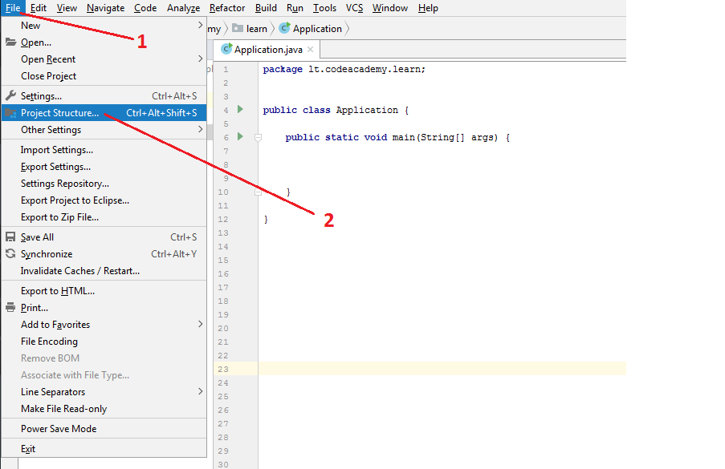

Pasirenkame, kad pridėsime Java biblioteką


Surandame ir pasirenkame turimą biblioteką


Pasirenkame modulį, į kurį importuosime biblioteką

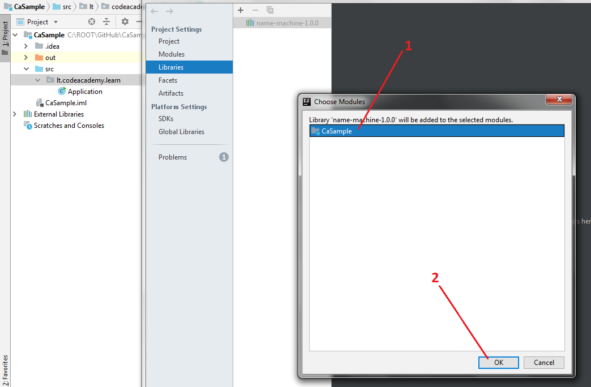

OK


Importuota biblioteka ir joje esantys failai matomi `External Libraries`

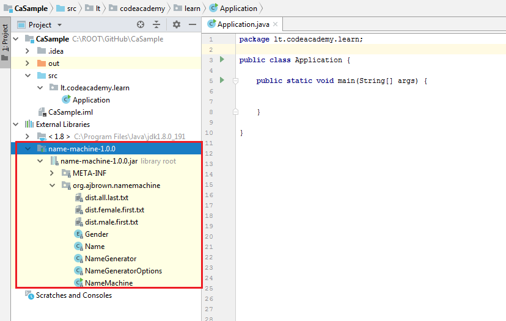

Išbandykime bibliotekos funkcijas
```java
import org.ajbrown.namemachine.Name;
import org.ajbrown.namemachine.NameGenerator;

import java.util.List;

public class Application {

    public static void main(String[] args) {

        NameGenerator generator = new NameGenerator();

        List<Name> names = generator.generateNames(1000);

        names.forEach(System.out::println);

    }
}
```
Programa mums sugeneruos 1000 vardų
```
George Mott
Rick Velarde
Tom Black
Alice Jackson
James Miller
Evelin Lewis
...
```

### Programos eksportavimas į *JAR* failą

Pasirenkame `File > Project Structure...`

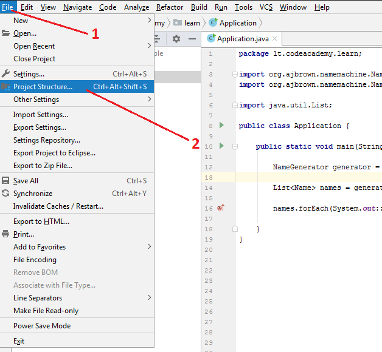

Pasirenkame `Artifacts > JAR > From modules with dependencies...`


Pasirenkame modulį ir nurodome klasę su `main` metodu


`Output directory` nurodome, kur saugoti `JAR` failą


Pasirenkame `Build > Buils Arfifacts...`


Sukurtas `JAR` failas sukurtas


Programą supakuotą į `JAR` galime paleisti be IntelliJ naudojant komandinę eilutę

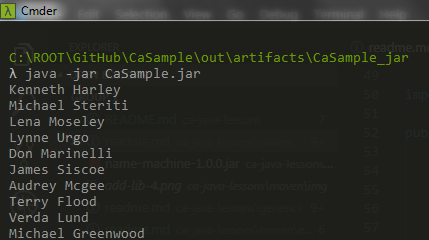

## Su *Maven*

### Projekto sukūrimas

Pasirenkame `File > New > Project...`

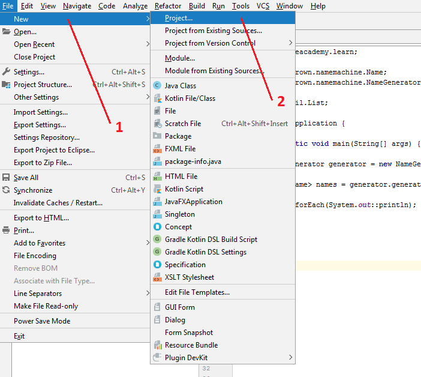

Renkamės kurti *Maven* tipo projektą. Taip pat pasirenkame Java versiją.

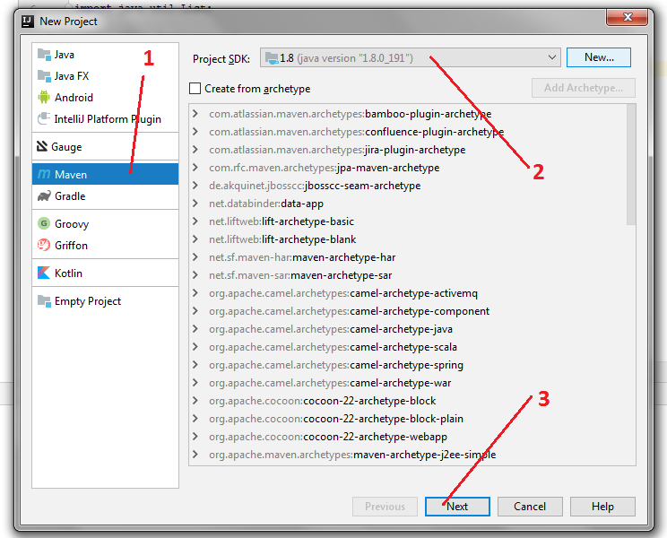

Nurodome `GroupId` ir `ArtifactId`. Versiją paliekame `1.0-SNAPSHOT` - tai numatytoji pradinė artefakto vesija.

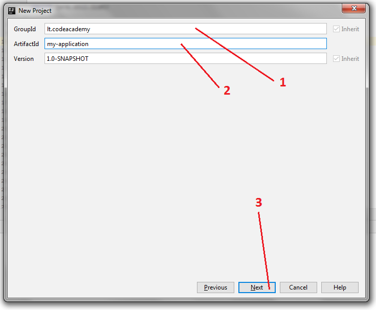

Nurodome projekto pavadinimą ir vietą, kur projektą saugoti.

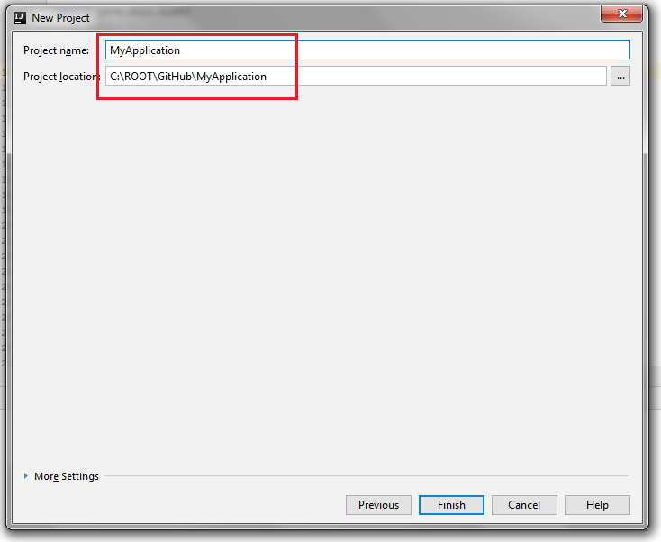

Sukurtas tuščias *Maven* projektas. 
1. Matome sugeneruotą `pom.xml` failą (apie jį šiek tiek vėliau)
2. *Maven* kortelė
3. Artefakto gyvavimo ciklai
4. `\src\main\java` kursime Java klases
5. Artefakto gyvavimo ciklo paleidimas

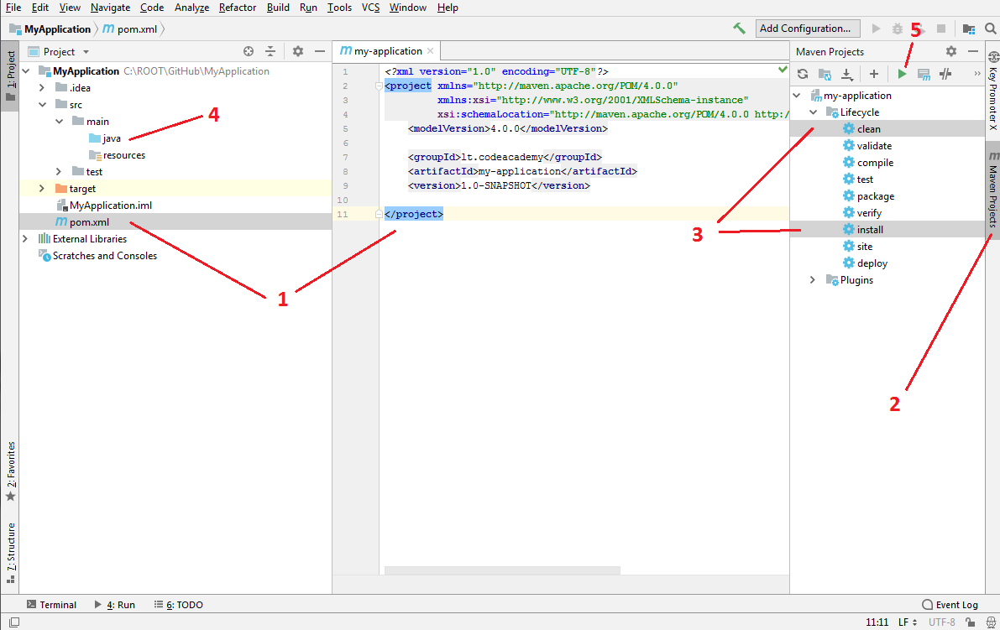

`pom.xml` faile yra `groupId`, `artifactId` ir `version`, kuriuos nurodėme kurdami projektą.

```xml
<?xml version="1.0" encoding="UTF-8"?>
<project xmlns="http://maven.apache.org/POM/4.0.0"
         xmlns:xsi="http://www.w3.org/2001/XMLSchema-instance"
         xsi:schemaLocation="http://maven.apache.org/POM/4.0.0 http://maven.apache.org/xsd/maven-4.0.0.xsd">
    <modelVersion>4.0.0</modelVersion>

    <groupId>lt.codeacademy</groupId>
    <artifactId>my-application</artifactId>
    <version>1.0-SNAPSHOT</version>

</project>
```

`pom.xml` faile nurodykite, kad dirbate su Java 8 versija:

```xml
<properties>
    <maven.compiler.target>1.8</maven.compiler.target>
    <maven.compiler.source>1.8</maven.compiler.source>
</properties>
```

### *Dependency* pridėjimas

Į `pom.xml` failą pridėkite nuorodą į `name-machine` projektą. Šį priklausomybę (*dependency*) galima rasti [čia](https://search.maven.org/artifact/org.ajbrown/name-machine/1.0.0/jar)

```xml
<dependency>
    <groupId>org.ajbrown</groupId>
    <artifactId>name-machine</artifactId>
    <version>1.0.0</version>
</dependency>
```

### Artefakto sukūrimas

Modifikuotas `pom.xml` failas atrodo taip:

```xml
<?xml version="1.0" encoding="UTF-8"?>
<project xmlns="http://maven.apache.org/POM/4.0.0"
         xmlns:xsi="http://www.w3.org/2001/XMLSchema-instance"
         xsi:schemaLocation="http://maven.apache.org/POM/4.0.0 http://maven.apache.org/xsd/maven-4.0.0.xsd">
    <modelVersion>4.0.0</modelVersion>

    <groupId>lt.codeacademy</groupId>
    <artifactId>my-application</artifactId>
    <version>1.0-SNAPSHOT</version>

    <properties>
        <maven.compiler.target>1.8</maven.compiler.target>
        <maven.compiler.source>1.8</maven.compiler.source>
    </properties>

    <dependencies>
        <dependency>
            <groupId>org.ajbrown</groupId>
            <artifactId>name-machine</artifactId>
            <version>1.0.0</version>
        </dependency>
    </dependencies>

</project>
```

Pasirinkite artefakto gyvavimo ciklus `clean` bei `install` ir paleiskite.

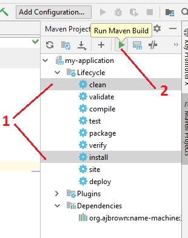

Jei viskas gerai, log'uose pamatysime tokį rezultatą:
```
...
[INFO] ------------------------------------------------------------------------
[INFO] BUILD SUCCESS
[INFO] ------------------------------------------------------------------------
...
```

### Java klasės sukūrimas

Sukurkime Java klasę su `main` metodu. Ir panaudokime `NameGenerator`:

```java
package lt.codeacademy;

import org.ajbrown.namemachine.Name;
import org.ajbrown.namemachine.NameGenerator;

import java.util.List;

public class Application {

    public static void main(String[] args) {

        NameGenerator generator = new NameGenerator();

        List<Name> names = generator.generateNames(1000);

        names.forEach(System.out::println);

    }

}
```

```
Samuel Arguedas
Charlotte Currier
Yvonne Mccaffrey
Renee Ciampi
David Lejeune
Donald Graham
David Mcelroy
...
```

Paleidus programą matome, kad programa veikia nepridėjus jokių bibliotekų. *Maven* reikiamą artefaktą, kuris atsakingas už vardų generavimą atsiuntė už mus iš nutolusios saugyklos. Kai pridėjome prilausomybę `dependency` į `pom.xml` failą, nuo to laiko galime naudoti `NameGenerator` visame mūsų projekte.

### Eksportavimas į *JAR* failą

Į `pom.xml` failą įdėkite plugin'ą, kuris supakuos programą į `JAR` failą su visomis priklausomomis bibliotekomis (*dependencies*), t.y. sukurs programos artefaktą, kurį galės naudoti kiti. Reikia nurodyti klasę (su paketu, jei toks naudojamas), kuri turi `main` metodą. Šio atveju `main` metodą turi klasė `lt.codeacademy.Application`.

```xml
<plugin>
    <groupId>org.apache.maven.plugins</groupId>
    <artifactId>maven-assembly-plugin</artifactId>
    <executions>
        <execution>
            <phase>package</phase>
            <goals>
                <goal>single</goal>
            </goals>
            <configuration>
                <archive>
                    <manifest>
                        <mainClass>
                            lt.codeacademy.Application
                        </mainClass>
                    </manifest>
                </archive>
                <descriptorRefs>
                    <descriptorRef>jar-with-dependencies</descriptorRef>
                </descriptorRefs>
            </configuration>
        </execution>
    </executions>
</plugin>
```

Modifikuotas `pom.xml` failas atrodo taip:

```xml
<?xml version="1.0" encoding="UTF-8"?>
<project xmlns="http://maven.apache.org/POM/4.0.0"
         xmlns:xsi="http://www.w3.org/2001/XMLSchema-instance"
         xsi:schemaLocation="http://maven.apache.org/POM/4.0.0 http://maven.apache.org/xsd/maven-4.0.0.xsd">
    <modelVersion>4.0.0</modelVersion>

    <groupId>lt.codeacademy</groupId>
    <artifactId>my-application</artifactId>
    <version>1.0-SNAPSHOT</version>

    <properties>
        <maven.compiler.target>1.8</maven.compiler.target>
        <maven.compiler.source>1.8</maven.compiler.source>
    </properties>

    <dependencies>
        <dependency>
            <groupId>org.ajbrown</groupId>
            <artifactId>name-machine</artifactId>
            <version>1.0.0</version>
        </dependency>
    </dependencies>

    <build>
        <plugins>
            <plugin>
                <groupId>org.apache.maven.plugins</groupId>
                <artifactId>maven-assembly-plugin</artifactId>
                <executions>
                    <execution>
                        <phase>package</phase>
                        <goals>
                            <goal>single</goal>
                        </goals>
                        <configuration>
                            <archive>
                                <manifest>
                                    <mainClass>
                                        lt.codeacademy.Application
                                    </mainClass>
                                </manifest>
                            </archive>
                            <descriptorRefs>
                                <descriptorRef>jar-with-dependencies</descriptorRef>
                            </descriptorRefs>
                        </configuration>
                    </execution>
                </executions>
            </plugin>
        </plugins>
    </build>

</project>
```

Įvykdykite artefakto gyvenimo ciklus `clean` ir `install`.

Po *build*'o `target` kataloge pamatysite  du `JAR` failus (artefaktus). Pirmasis `my-application-1.0-SNAPSHOT.jar` yra be priklausomybių, antrasis `my-application-1.0-SNAPSHOT-jar-with-dependencies.jar` - su visomis reikiamomis priklausomybės. T.y. priklausomybės yra išsaugotos `JAR` failo viduje. Tokią programą galite paleisti ir naudojantis komandine eilute:
```
java -jar my-application-1.0-SNAPSHOT-jar-with-dependencies.jar
```

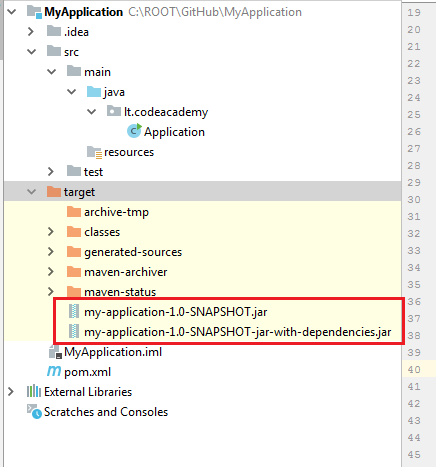

Tai yra ne vienintelis būdas pagaminti `JAR` failą. Daugiau jų galite rasti [čia](https://www.baeldung.com/executable-jar-with-maven)

## *Maven*

 *Maven* yra projekto valdymo įrankis padedantis valdyti:
- Artefaktus/bibliotekas (*Builds*)
- Dokumentaciją (*Documentation*)
- Ataskaitas (*Reporting*)
- Priklausomybes (*Dependencies*)
- Programinės įrangos konfigūracijas (*SCMs*)
- Versijų leidimus (*Releases*)
- Paskirstymą (*Distribution*)

### Artefakto gyvavimo ciklo fazės

Fazė|Paaiškinimas
---|---
`validate`|Patikrina ar projektas korektiškas ir visa reikiama informacija yra pasiekiama
`compile`|Kompiliuoja projekto išeities kodą
`test`|Naudojant nurodytą testavimo karkasą testuoja sukompiliuotą išeities kodą
`package`|Supakuoja sukompiliuotą kodą į paskirstymo formatą, pvz JAR
`integration-test`|Įdiegia paketus į aplinką, kurioje vykdomi integraciniai testai
`verify`|Patikrina ar paketas atitinka kokybės kriterijus
`install`|Įdiegia paketą į lokalią saugyklą tam, kad kiti lokalūs projektai galėtų jį naudoti
`deploy`|Įdiegia paketą į nutolusią saugyklą tam, kad kiti projektai ar programuotojai galėtų jį naudoti
`clean`|Pašalina visus failus, kurie buvo sugeneruoti ankstesnio build'o metu
`site`|Generuoja projekto dokumentaciją

## POM

POM yra projekto objektinis modelis (*Project Object Model*). POM yra pagrindinė *Maven* projekto dalis, joje yra visa projekto konfigūracija. POM yra rašomas XML ženklinimo kalba ir įprastai failo pavadinimas yra `pom.xml`.

### POM struktūra

```xml
<project xmlns="http://maven.apache.org/POM/4.0.0"
  xmlns:xsi="http://www.w3.org/2001/XMLSchema-instance"
  xsi:schemaLocation="http://maven.apache.org/POM/4.0.0
                      http://maven.apache.org/xsd/maven-4.0.0.xsd">
  <modelVersion>4.0.0</modelVersion>
 
  <!-- Pagrindai -->
  <groupId>...</groupId>
  <artifactId>...</artifactId>
  <version>...</version>
  <packaging>...</packaging>
  <dependencies>...</dependencies>
  <parent>...</parent>
  <dependencyManagement>...</dependencyManagement>
  <modules>...</modules>
  <properties>...</properties>
 
  <!-- Artefakto sudarymo nustatymai -->
  <build>...</build>
  <reporting>...</reporting>
 
  <!-- Papildoma informacija apie projektą -->
  <name>...</name>
  <description>...</description>
  <url>...</url>
  <inceptionYear>...</inceptionYear>
  <licenses>...</licenses>
  <organization>...</organization>
  <developers>...</developers>
  <contributors>...</contributors>
 
  <!-- Aplinkos nustatymai -->
  <issueManagement>...</issueManagement>
  <ciManagement>...</ciManagement>
  <mailingLists>...</mailingLists>
  <scm>...</scm>
  <prerequisites>...</prerequisites>
  <repositories>...</repositories>
  <pluginRepositories>...</pluginRepositories>
  <distributionManagement>...</distributionManagement>
  <profiles>...</profiles>
</project>
```

### POM elementai

- `groupId`: Elementas, kuris yra bendras visai organizacijai arba projektui, pvz.: `lt.codeacademy.learn`
- `artifactId`: Projekto vardas, pvz.: `my-project`. Kombinacija `groupId` ir `artifactId` turėtų būti unikali visame pasaulyje.
- `version`: Projekto versija
- `packaging`: Paketo formatas. Galimos reikšmės: `pom`, `jar`, `maven-plugin`, `ejb`, `war`, `ear`, `rar`. Numaytoji reikšmė - `jar`.
- `dependencies`: kitų artefaktų priklasomybės.
    Pavyzdys:

    ```xml
    <project xmlns="http://maven.apache.org/POM/4.0.0"
            xmlns:xsi="http://www.w3.org/2001/XMLSchema-instance"
            xsi:schemaLocation="http://maven.apache.org/POM/4.0.0
                        https://maven.apache.org/xsd/maven-4.0.0.xsd">
        ...
        <dependencies>
            <dependency>
                <groupId>junit</groupId>
                <artifactId>junit</artifactId>
                <version>4.12</version>
                <type>jar</type>
                <scope>test</scope>
                <optional>true</optional>
            </dependency>
            ...
        </dependencies>
        ...
    </project>
    ```
    - `groupId`, `artifactId` ir `version`: artefakto pagrindiniai duomenys.
    - `type`: Galimos reikšmės: `pom`, `jar`, `test-jar`, `maven-plugin`, `ejb`, `ejb-client`, `war`, `ear`, `rar`, `java-source` ir `javadoc`. Numatytoji reikšmė - `jar`.
    - `scope`: Galimos reikšmės: `compile`, `provided`, `runtime`, `test` ir `system`. Numatytoji reikšmė - `compile`.
    - `systemPath`: Naudojamas tik tada, kai `scope` reikšmė yra `system`.
    - `optional`: `true` arba `false`.
    - `exclusions`: Galima nurodyti, kokios priklausomubės dalis nereikia. Pavyzdys:

        ```xml
        <project xmlns="http://maven.apache.org/POM/4.0.0"
                xmlns:xsi="http://www.w3.org/2001/XMLSchema-instance"
                xsi:schemaLocation="http://maven.apache.org/POM/4.0.0
                                    https://maven.apache.org/xsd/maven-4.0.0.xsd">
                ...
                <dependencies>
                    <dependency>
                        <groupId>org.apache.maven</groupId>
                        <artifactId>maven-embedder</artifactId>
                        <version>2.0</version>
                        <exclusions>
                            <exclusion>
                            <groupId>org.apache.maven</groupId>
                            <artifactId>maven-core</artifactId>
                            </exclusion>
                        </exclusions>
                    </dependency>
                    ...
                </dependencies>
                ...
                </project>
        ```
- `parent`: Paveldėjimas. Pavyzdys: Turime "tėvinį" POM:
    ```xml
    <project xmlns="http://maven.apache.org/POM/4.0.0"
            xmlns:xsi="http://www.w3.org/2001/XMLSchema-instance"
            xsi:schemaLocation="http://maven.apache.org/POM/4.0.0
                                https://maven.apache.org/xsd/maven-4.0.0.xsd">
        <modelVersion>4.0.0</modelVersion>
        
        <groupId>org.codehaus.mojo</groupId>
        <artifactId>my-parent</artifactId>
        <version>2.0</version>
        <packaging>pom</packaging>
    </project>
    ```
    "Tėviniame" POM'e elementas `packaging` turi būti `pom`.
    Tada "vaikinis" POM atrodys taip:
    ```xml
    <project xmlns="http://maven.apache.org/POM/4.0.0"
            xmlns:xsi="http://www.w3.org/2001/XMLSchema-instance"
            xsi:schemaLocation="http://maven.apache.org/POM/4.0.0
                                https://maven.apache.org/xsd/maven-4.0.0.xsd">
        <modelVersion>4.0.0</modelVersion>
        
        <parent>
            <groupId>org.codehaus.mojo</groupId>
            <artifactId>my-parent</artifactId>
            <version>2.0</version>
            <relativePath>../my-parent</relativePath>
        </parent>
        
        <artifactId>my-project</artifactId>
    </project>
    ```
- `dependencyManagement`: Supaprastina priklausomybių aprašymą, kai yra vienas "tėvinis" POM ir keli "vaikiniai" POM, kurie naudoja tas pačias priklausomybes. Pavyzdys:

    ```xml
    <!-- ParentProj pom -->
    <project>
    <dependencyManagement>
        <dependencies>
        <dependency> <!-- not much benefit defining alpha here, as we only use in 1 child, so optional -->
            <groupId>alpha</groupId>
            <artifactId>alpha</artifactId>
            <version>1.0</version>
            <exclusions>
            <exclusion>
                <groupId>zebra</groupId>
                <artifactId>zebra</artifactId>
            </exclusion>
            </exclusions>
        </dependency>
        <dependency>
            <groupId>charlie</groupId> <!-- not much benefit defining charlie here, so optional -->
            <artifactId>charlie</artifactId>
            <version>1.0</version>
            <type>war</type>
            <scope>runtime</scope>
        </dependency>
        <dependency> <!-- defining betaShared here makes a lot of sense -->
            <groupId>betaShared</groupId>
            <artifactId>betaShared</artifactId>
            <version>1.0</version>
            <type>bar</type>
            <scope>runtime</scope>
        </dependency>
        </dependencies>
    </dependencyManagement>
    </project>

    <!-- Child Proj1 pom -->
    <project>
    <dependencies>
        <dependency>
        <groupId>alpha</groupId>
        <artifactId>alpha</artifactId>  <!-- jar type IS DEFAULT, so no need to specify in child projects -->
        </dependency>
        <dependency>
        <groupId>betaShared</groupId>
        <artifactId>betaShared</artifactId>
        <type>bar</type> <!-- This is not a jar dependency, so we must specify type. -->
        </dependency>
    </dependencies>
    </project>

    <!-- Child Proj2 -->
    <project>
    <dependencies>
        <dependency>
        <groupId>charlie</groupId>
        <artifactId>charlie</artifactId>
        <type>war</type> <!-- This is not a jar dependency, so we must specify type. -->
        </dependency>
        <dependency>
        <groupId>betaShared</groupId> 
        <artifactId>betaShared</artifactId> 
        <type>bar</type> <!-- This is not a jar dependency, so we must specify type. -->
        </dependency>
    </dependencies>
    </project>
    ```

- `modules`: Naudojamas kelių projektų agregavimui. Pavyzdys:
    ```xml
    <project xmlns="http://maven.apache.org/POM/4.0.0"
            xmlns:xsi="http://www.w3.org/2001/XMLSchema-instance"
            xsi:schemaLocation="http://maven.apache.org/POM/4.0.0
                            https://maven.apache.org/xsd/maven-4.0.0.xsd">
        <modelVersion>4.0.0</modelVersion>
        
        <groupId>org.codehaus.mojo</groupId>
        <artifactId>my-parent</artifactId>
        <version>2.0</version>
        <packaging>pom</packaging>
        
        <modules>
            <module>my-project</module>
            <module>another-project</module>
            <module>third-project/pom-example.xml</module>
        </modules>
    </project>
    ```
- `properties`: Galime turėti savybes, kurias galime naudoti visame POM'e. Pavyzdys:

    ```xml
    <project xmlns="http://maven.apache.org/POM/4.0.0"
            xmlns:xsi="http://www.w3.org/2001/XMLSchema-instance"
            xsi:schemaLocation="http://maven.apache.org/POM/4.0.0
                            https://maven.apache.org/xsd/maven-4.0.0.xsd">
        ...
        <properties>
            <maven.embedder.version>3.1.0</maven.embedder.version>
            <project.build.sourceEncoding>UTF-8</project.build.sourceEncoding>
            <project.reporting.outputEncoding>UTF-8</project.reporting.outputEncoding>
        </properties>
        ...
        <dependencies>
            <dependency>
                <groupId>org.apache.maven</groupId>
                <artifactId>maven-embedder</artifactId>
                <version>${maven.embedder.version}</version>
            </dependency>
            ...
        </dependencies>
        ...
    </project>
    ```


## *Maven* alternatyvos
- [Gradle](https://gradle.org/)
- [Ant](https://ant.apache.org/)
- Kitos alternatyvos https://alternativeto.net/software/maven/

## Naudingos nuorodos
- Saugyklos: 
    - https://mvnrepository.com/
    - https://search.maven.org/
- IntelliJ Maven konfigūracija https://www.jetbrains.com/help/idea/maven.html
- Naudingos bibliotekos: https://github.com/akullpp/awesome-java

## Tolesniam skaitymui
- Maven https://maven.apache.org/
- POM https://maven.apache.org/pom.html

## Užduotys
- [Užduotys](exercises/readme.md)
