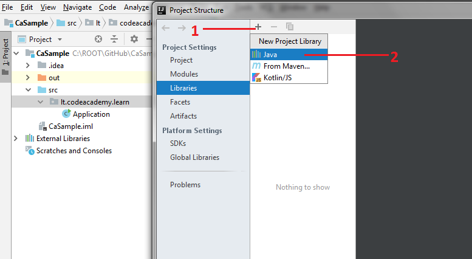
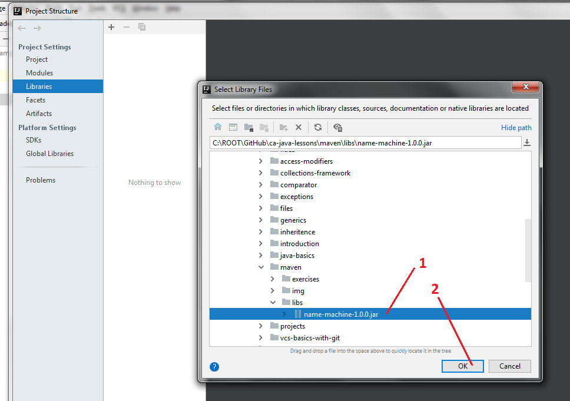
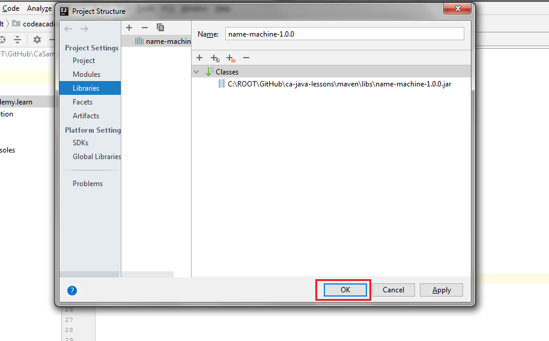
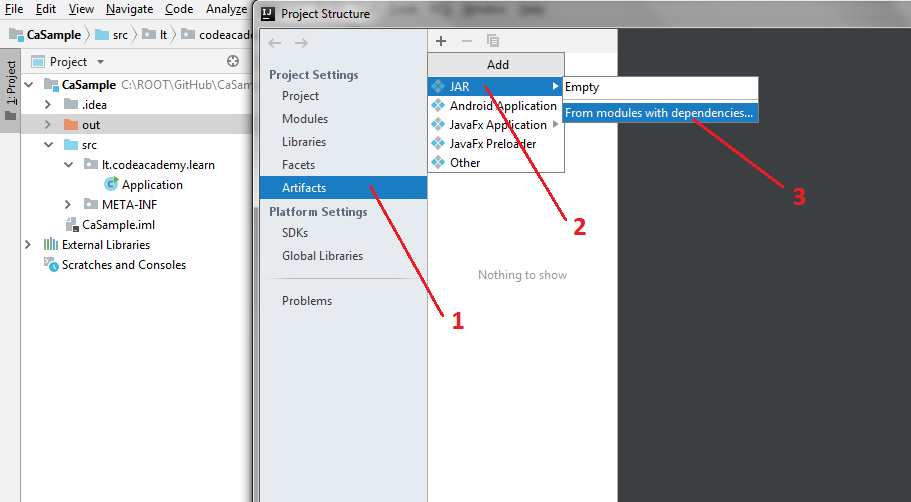
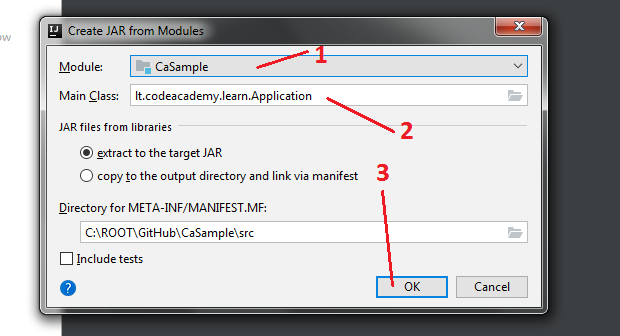
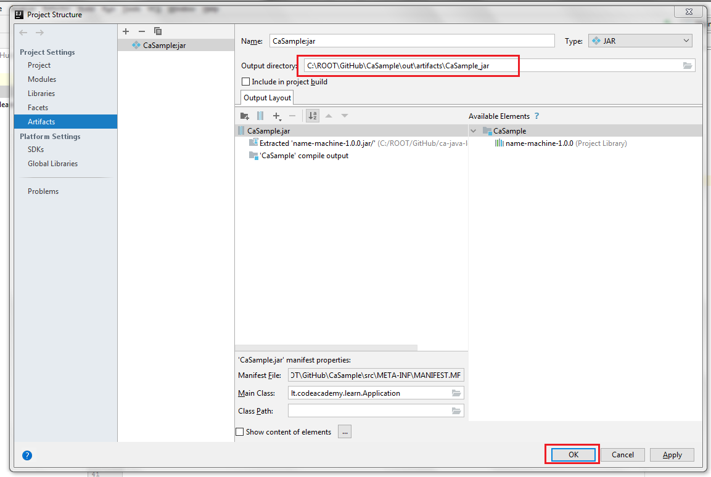
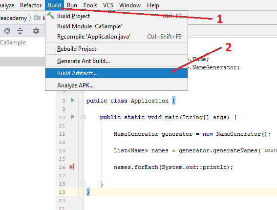
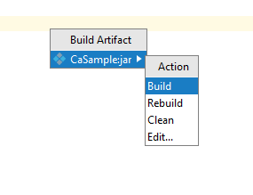
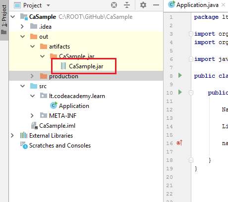

# *Maven*


## Turinys
- [Tikslas](#Tikslas)
- [Be *Maven*](#Be-*Maven*)
    - [Bibliotekos pridėjimas](#bibliotekos-pridėjimas)
    - [Programos eksportavimas į *JAR* failą](#Programos-eksportavimas-į-*JAR*-failą)
- [Naudingos nuorodos](#Naudingos-nuorodos)
- [Tolesniam skaitymui](#Tolesniam-skaitymui)
- [Užduotys](#Užduotys)

## Tikslas

Kitas programuotojas sukūrė [Java programą](https://github.com/ajbrown/name-machine) (artefaktą), kuri moka generuoti vardus ir pavardes. Mes norime pasinaudoti tos programos funkcijomis savo programoje. Galime tai padaryti keliais skirtingais būdais. Šiame kurse apžvelgsime du - be *Maven* bibliotekos įdėjimą per IntelliJ ir su *Maven*.

## Be *Maven*

### Bibliotekos pridėjimas

https://github.com/ajbrown/name-machine

[Atsisiųsti bibioteką](https://search.maven.org/remotecontent?filepath=org/ajbrown/name-machine/1.0.0/name-machine-1.0.0.jar)

Pasirenkame `File > Project Structure...`


Pasirenkame, kad pridėsime Java biblioteką



Surandame ir pasirenkame turimą biblioteką



Pasirenkame modulį, į kurį importuosime biblioteką


OK



Importuota biblioteka ir joje esantys failai matomi `External Libraries`


Išbandykime bibliotekos funkcijas
```java
import org.ajbrown.namemachine.Name;
import org.ajbrown.namemachine.NameGenerator;

import java.util.List;

public class Application {

    public static void main(String[] args) {

        NameGenerator generator = new NameGenerator();

        List<Name> names = generator.generateNames(1000);

        names.forEach(System.out::println);

    }
}
```
Programa mums sugeneruos 1000 vardų
```
George Mott
Rick Velarde
Tom Black
Alice Jackson
James Miller
Evelin Lewis
...
```

### Programos eksportavimas į *JAR* failą

Pasirenkame `File > Project Structure...`


Pasirenkame `Artifacts > JAR > From modules with dependencies...`



Pasirenkame modulį ir nurodome klasę su `main` metodu



`Output directory` nurodome, kur saugoti `JAR` failą



Pasirenkame `Build > Buils Arfifacts...`





Sukurtas `JAR` failas sukurtas



Programą supakuotą į `JAR` galime paleisti be IntelliJ naudojant komandinę eilutę


## Naudingos nuorodos
- Saugyklos: 
    - https://mvnrepository.com/
    - https://search.maven.org/
- IntelliJ Maven konfigūracija https://www.jetbrains.com/help/idea/maven.html
- Naudingos bibliotekos: https://github.com/akullpp/awesome-java

## Tolesniam skaitymui
- Maven https://maven.apache.org/
- POM https://maven.apache.org/pom.html

## Užduotys
- [Užduotys](exercises/readme.md)
